## Restaurant Kitchen Service Project
Django project for managing local restaurant kitchen with dishes, cooks, dish types,
ingredients and specializations.


## Check it out


## Installation

Python 3.11 must be already installed.

```shell
git clone https://github.com/Mazur-Mariia-Python/py-restaurant-service
python -m venv venv
venv\Scripts\activate
pip install -r requirements.txt
python manage.py runserver
``` 

## Features

* Authentication functionality for Cook/User.
* Managing dishes, cooks, dish types, ingredients and specializations directly
from website interface.
* Powerful admin panel for advanced managing.

## DB structure

   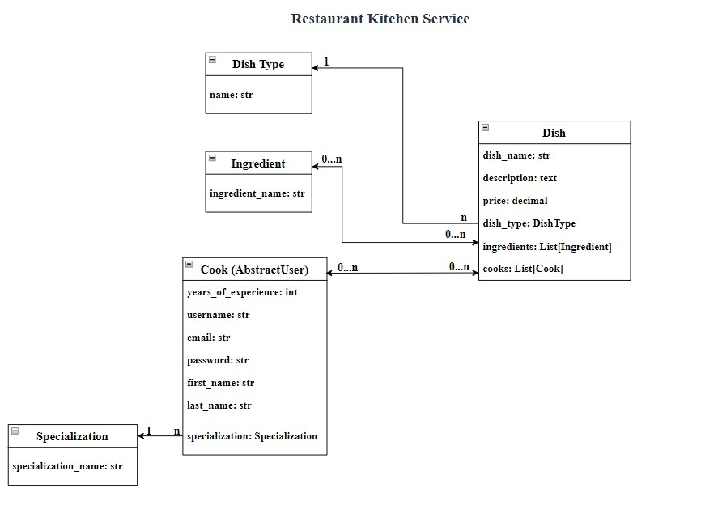


## Demo

Pages images:

1. Home page.
   
2. Login page.
   
3. Logout page.
   
4. Cooks list page.
   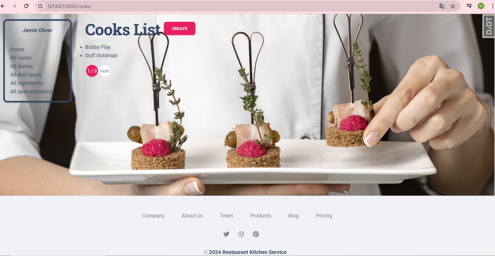
5. Cook detail page.
   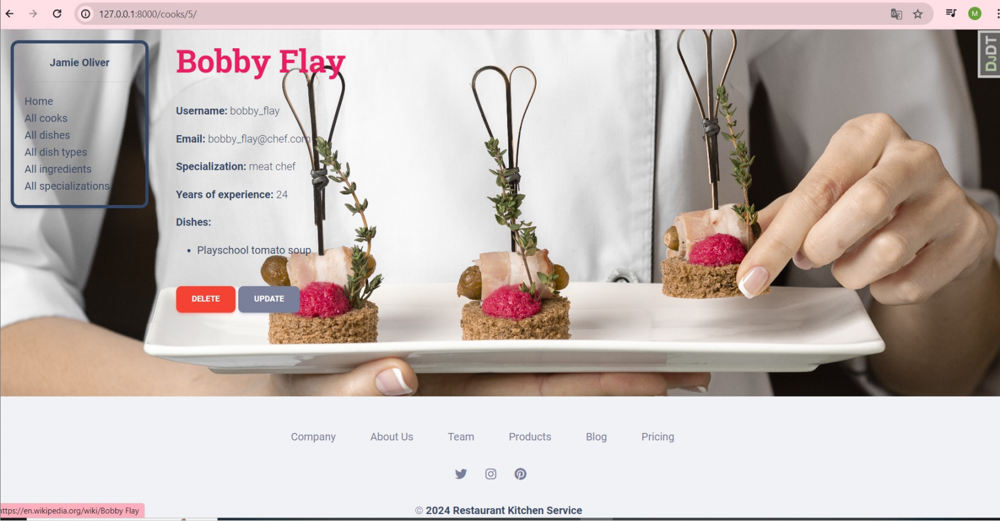
6. Cook create page.
   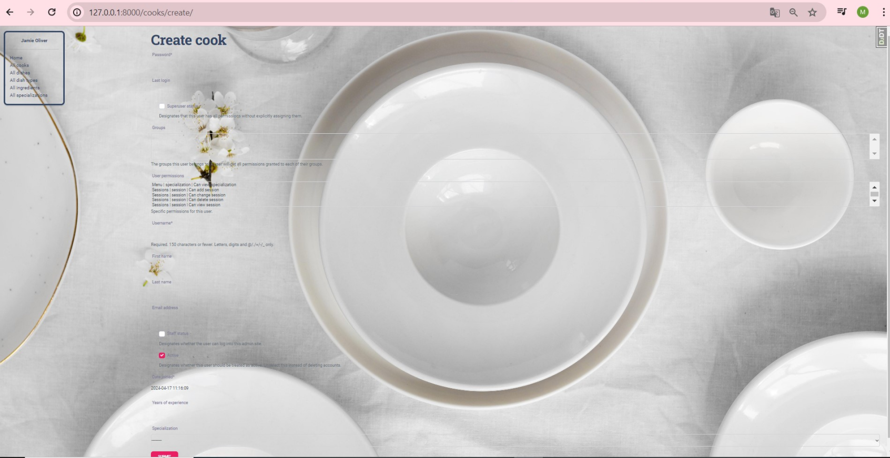
7. Cook update page.
   
8. Cook delete page.
   
9. Dishes list page.
   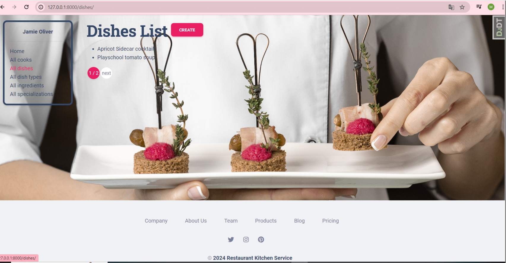
10. Dish detail page.
   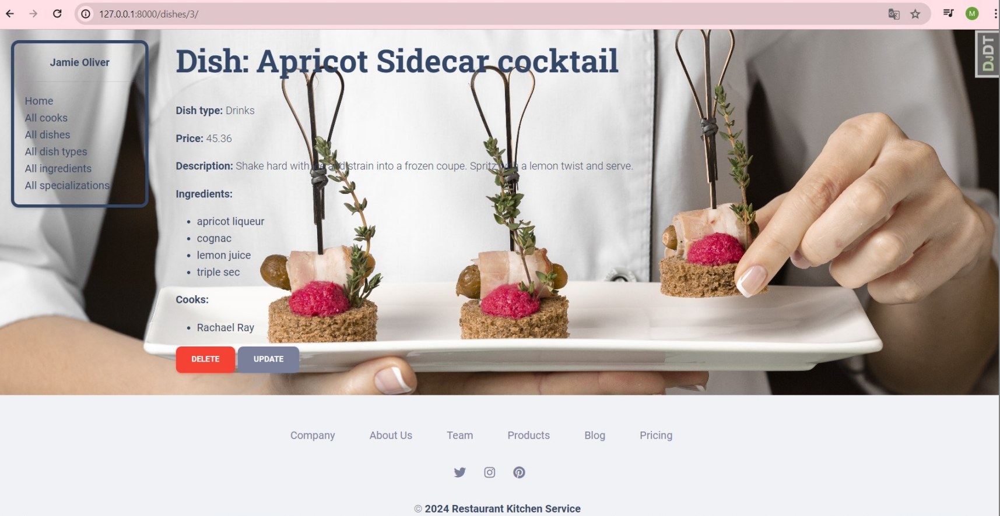
11. Dish create page.
   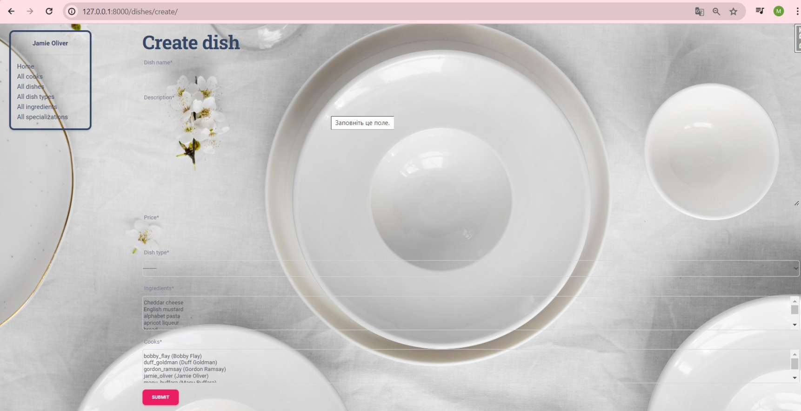
12. Dish update page.
   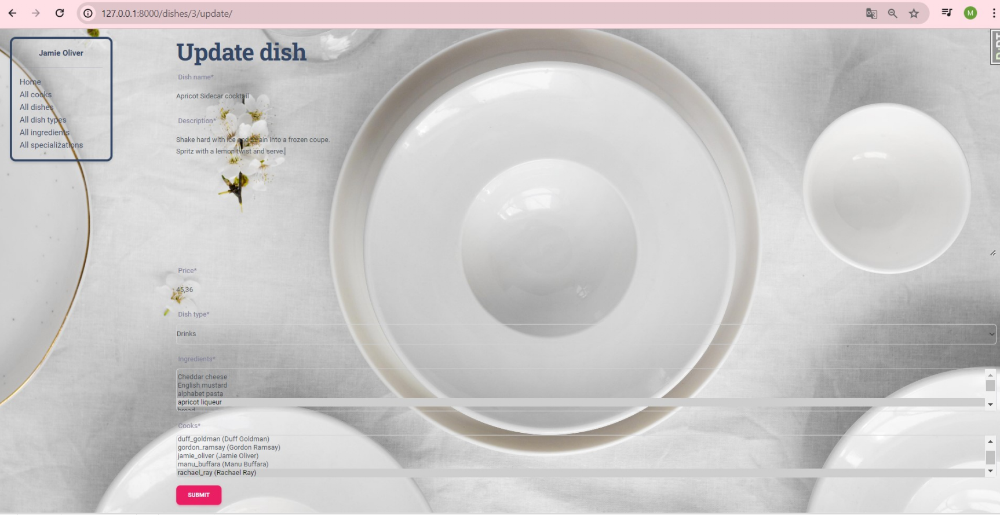
13. Dish delete page.
   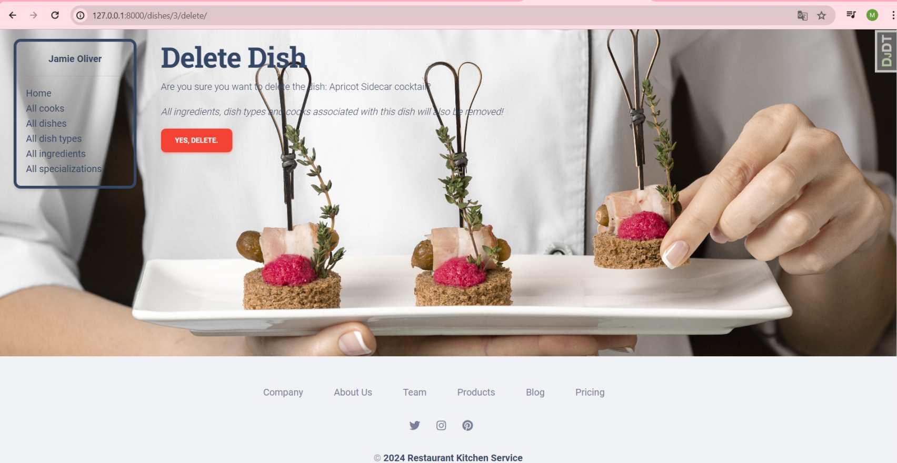
14. Dish types list page.
   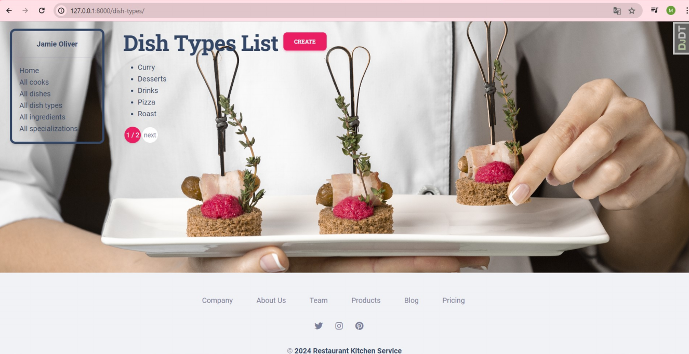
15. Dish type detail page.
   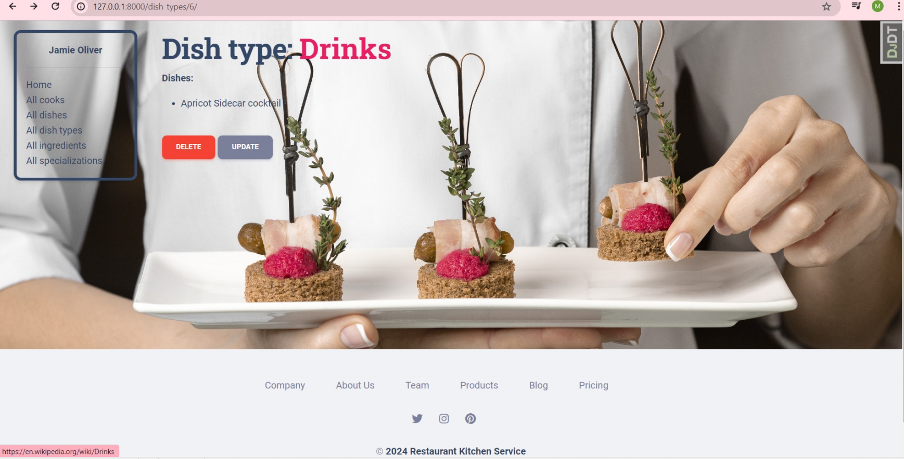
16. Dish type create page.
   
17. Dish type update page.
  
18. Dish type delete page.
   
19. Ingredients list page.
   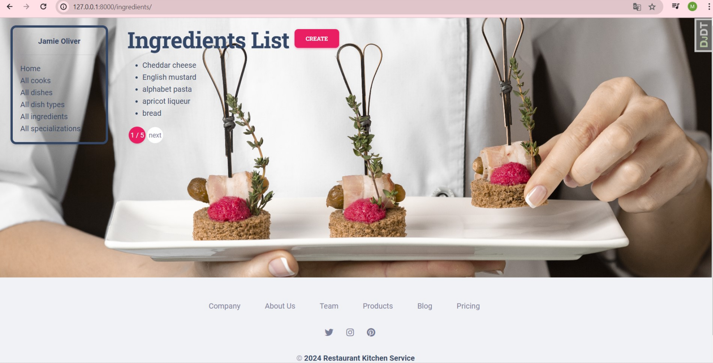
20. Ingredient detail page.
   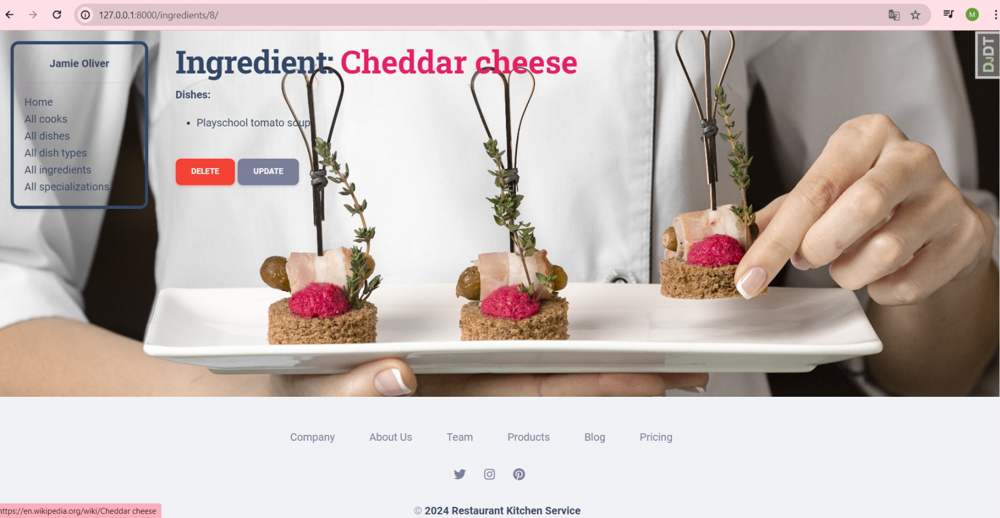
21. Ingredient create page.
   
22. Ingredient update page.
  
23. Ingredient delete page.
   
24. Specializations list page.
   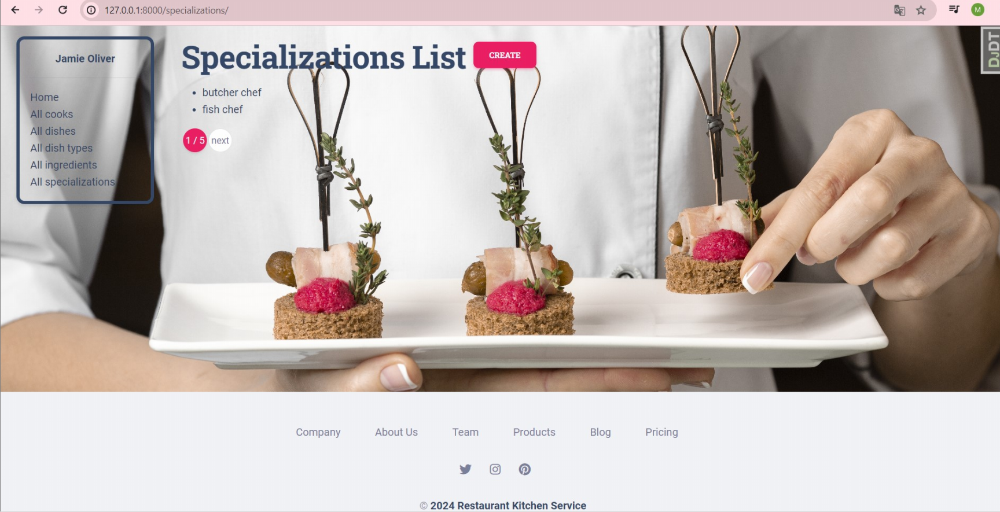
25. Specialization detail page.
   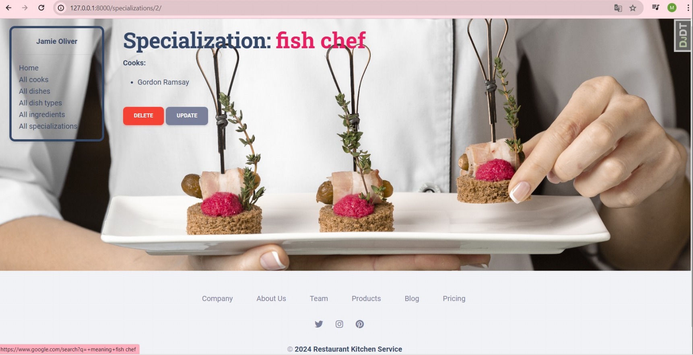
26. Specialization create page.
   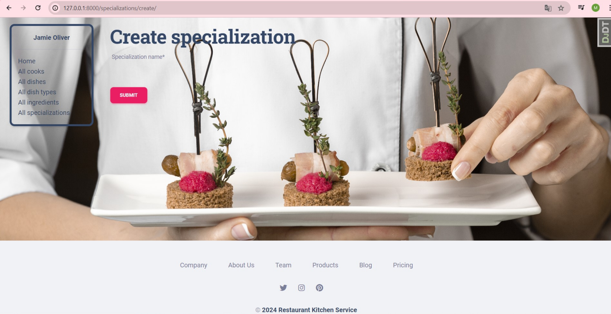
27. Specialization update page.
  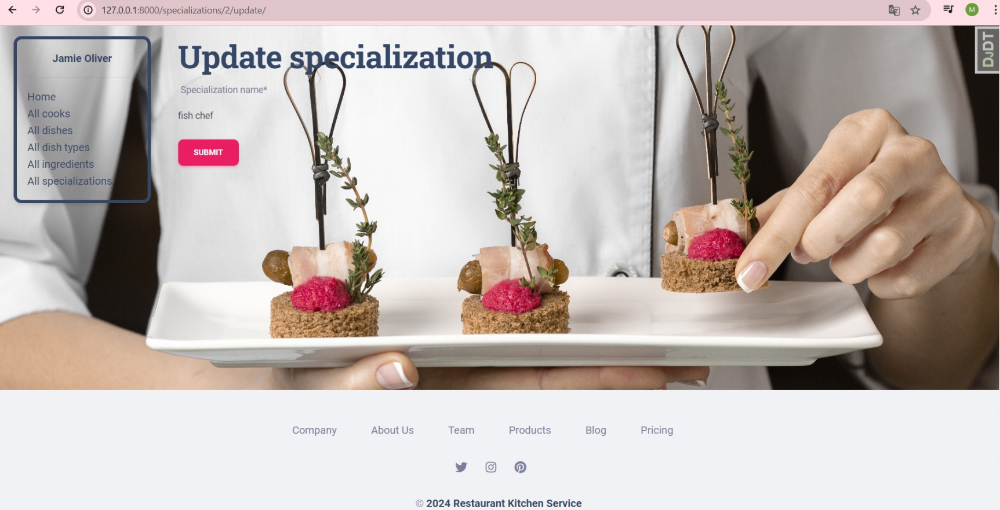
28. Specialization delete page.
   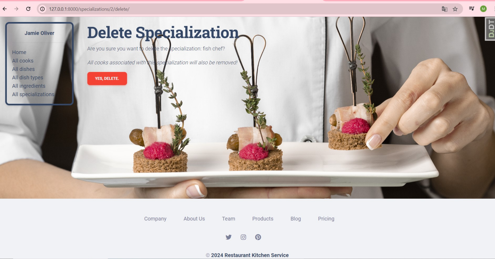