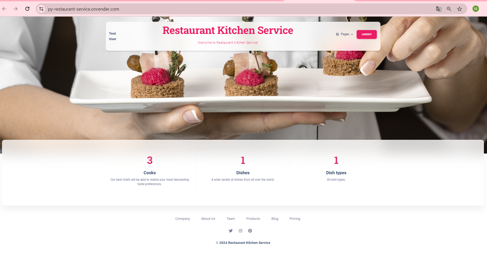
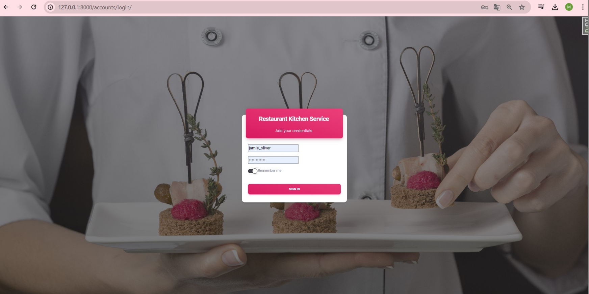

**Restaurant Kitchen Service Project**

Project for managing local restaurant kitchen with dishes, cooks, dish types and ingredients.

**Installation**
Python 3.11 must be already installed.

git clone https://github.com/Mazur-Mariia-Python/py-restaurant-service
Create venv: python -m venv venv
Activate it: venv\Scripts\activate
Install requirements: pip install -r requirements.txt
Run app: python manage.py runserver

**Description**
* Authentication functionality for User.
* Managing dishes, cooks, dish types and ingredients.
* Powerful admin panel for advanced managing.

**Diagrama of project**

**Project Preview**
1. Home page.
   
2. Login page.
   
3. Logout page.
   
